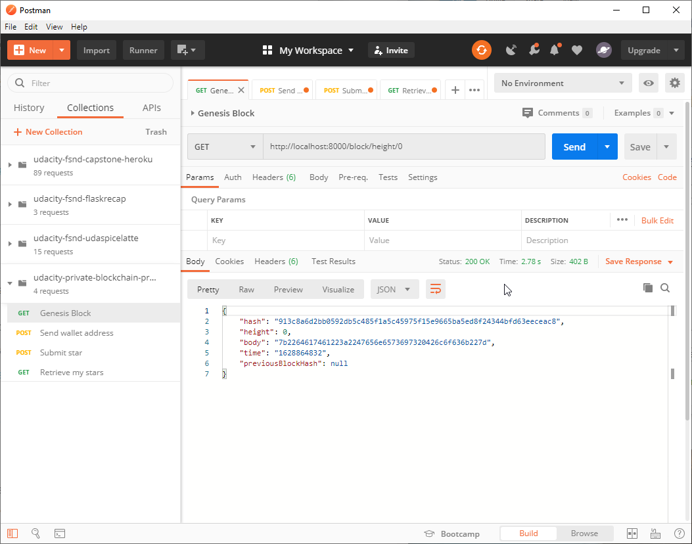
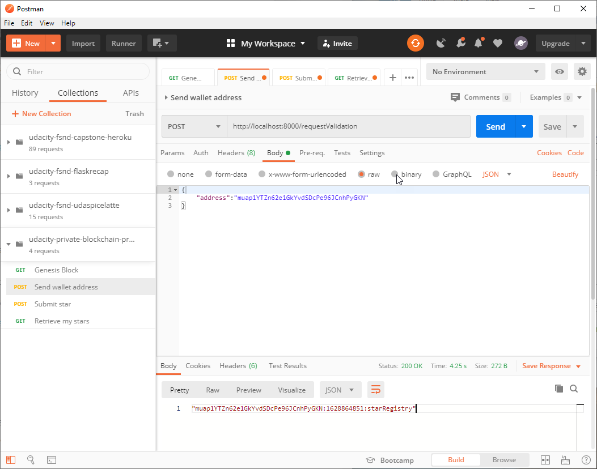
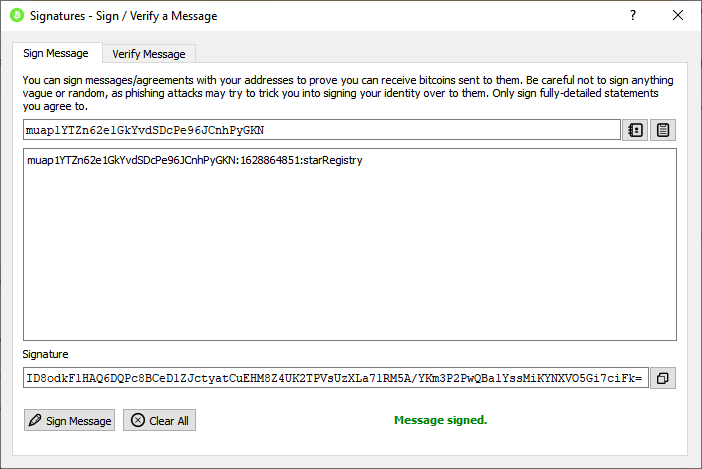
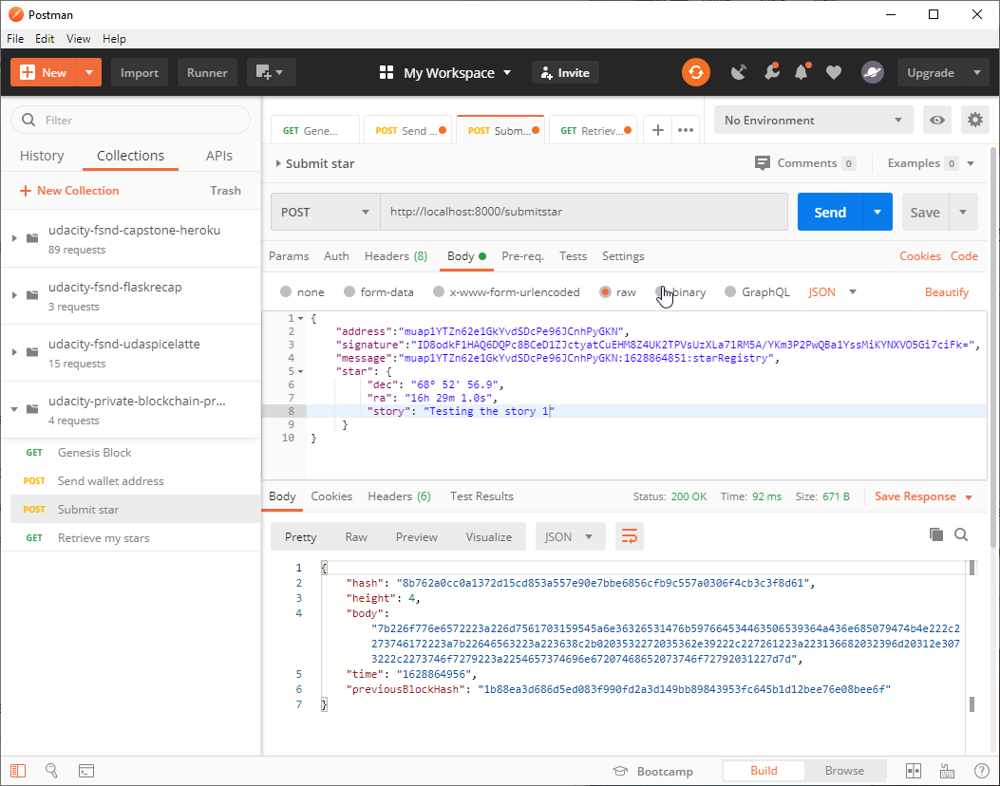
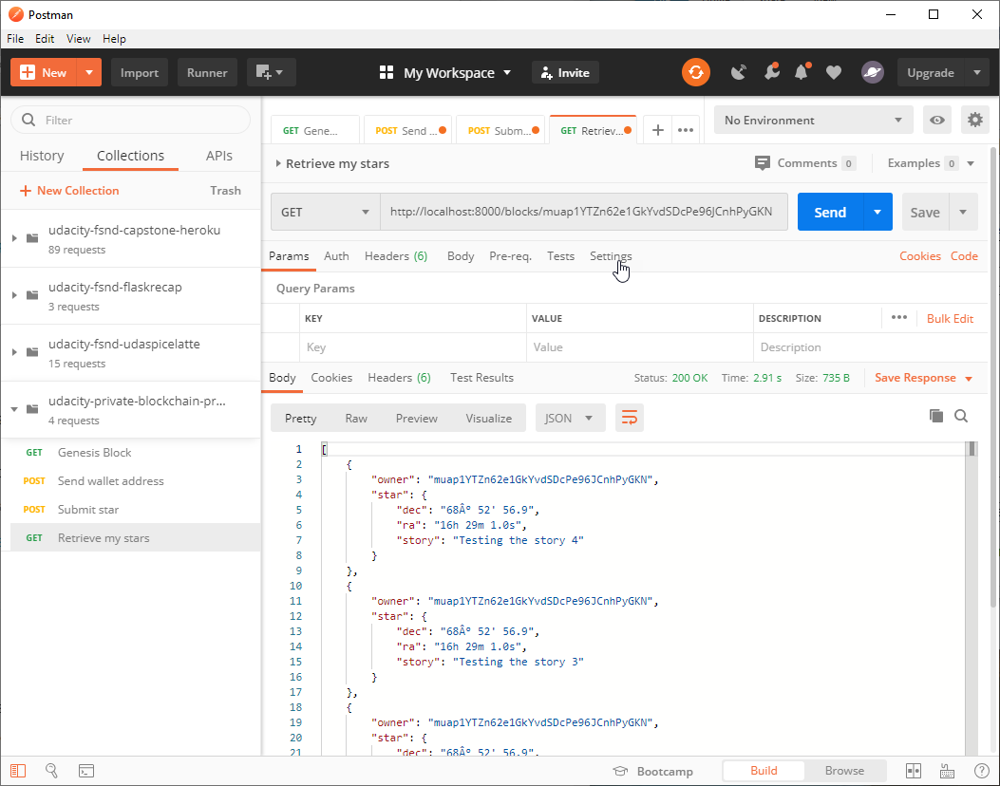

# Private Blockchain Application

This repository contains the solution for Udacity's Blockchain Developer Nanodegree project: Creating your own private block chain".  The details of the project can be found in [Project_README.md].

## Installation and Running

To run the application, download the files to a local directory.  From inside the directory, install the necessary node.js packages:

```bash
npm install
```

To start the server:

```bash
node app.js
```

The application is will be available on http://localhost:8000

## Testing
Testing can be performed using `curl` or PostMan.  Shown below are the steps for testing the applciation with PostMan.

Step 1: Create/test the genesis block



Step 2: Request ownership by submitting a wallet address



Step 3: Sign the address in your wallet



Step 4: Submit a star



Step 5: Retrieve listing of stars by owner

